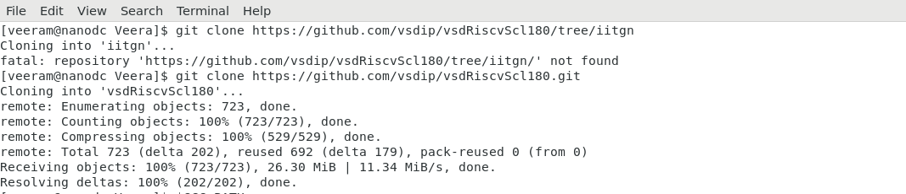
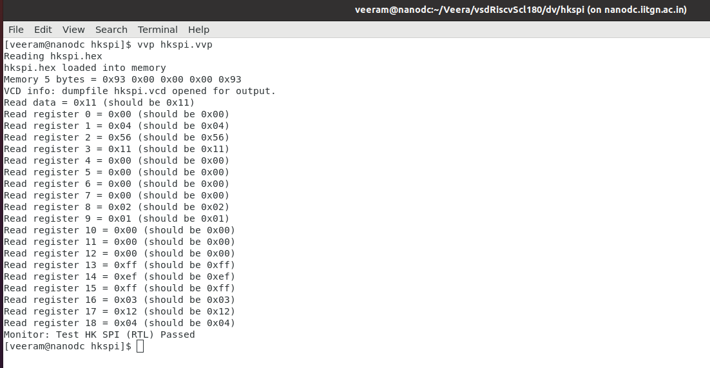
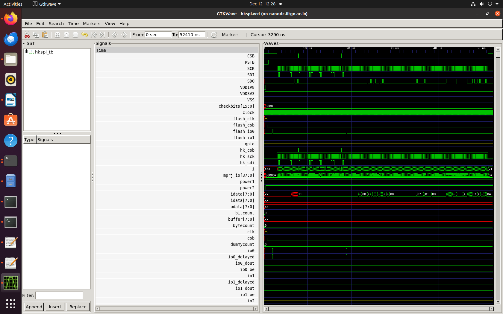

# RISC-V Reference SoC Implementation using Synopsys and SCL180 PDK  
*A Complete RTL → Synthesis → GLS Flow for VSDCaravel*

## Overview
This repository contains the implementation of a **RISC-V Reference SoC** using the **SCL180 PDK** and **Synopsys Design Tools**, following a complete RTL-to-GLS ASIC design flow.

The SoC used here is **VSDCaravel**, a modified version of the original *Caravel* SoC from Efabless, re-targeted for:
- **SCL180 technology**,  
- **Synopsys-based synthesis**, and  
- **Educational tapeout workflows** under VSD + SCL programs.

This project demonstrates:
- Functional simulation  
- RTL synthesis  
- Gate-level simulation  
- Testbench-based verification  
- Comparison between RTL and GLS  


- **Mentored by:** VLSI System Design (VSD) team  
- **PDK:** SCL180  
- **Tools:** Synopsys Design Tools  
- **Top Module:** vsdcaravel  

> **caravel** = Efabless + Sky130 + Opensource  
> **vsdcaravel** = VSD + SCL180 + Synopsys  

---

## Features
- Full **RTL → Synthesis → GLS** workflow  
- Uses **SCL180 standard cells** and **I/O libraries**  
- Compatible with Synopsys Design Compiler  
- Functional and gate-level simulation for validation  
- Highly modular and reproducible design flow  
- Tapeout-ready methodology  
- Includes cleaned RTL + synthesis scripts for educational purposes  

---

## Additional Background

### What is Caravel?
Caravel is an open-source SoC "carrier" developed by Efabless. It provides:
- A **management SoC** (RISC-V)  
- A **user project area** for custom logic  
- A **housekeeping SPI** interface  
- Wishbone bus communication  
- GPIO padframe  

It allows designers to integrate custom logic into a standard SoC platform.

### What is VSDCaravel?
VSDCaravel is a **technology-mapped version of Caravel** built for:
- Learners under the VSD–SCL program  
- Synopsys-based ASIC flow  
- SCL180 PDK compatibility  

It mirrors the architecture of Caravel but is optimized for:
- Synopsys Design Compiler  
- SCL standard cells  
- Educational SoC verification  

---

## Caravel / VSDCaravel Architecture Overview

The architecture consists of:

### **1. Management SoC (RISC-V Core)**
- Controls startup  
- Communicates with user logic  
- Runs small firmware for interfacing  

### **2. Housekeeping SPI Interface**
- Used to configure the chip  
- Handles GPIO mode, clock selection, power modes  
- Communicates with on-chip logic  

### **3. Wishbone Interconnect**
- The main bus connecting management SoC ↔ user project area  

### **4. User Project Area**
- Where user RTL is placed  
- In this project, HK-SPI testbench is primarily validated  

### **5. I/O Padframe**
- Exposes signals to top-level pins  
- Provided by SCL I/O PDK  


This structure makes VSDCaravel an ideal teaching SoC.

---

## Repository Structure
```bash
VsdRiscvScl180/
├── dv             # Functional verification files 
├── gl             # GLS support files
├── gls            # Testbench + synthesized netlist GLS setup
├── rtl            # RTL Verilog sources      
├── synthesis      # Synthesis scripts & outputs
│   ├── output     # Synthesized netlist
│   ├── report     # Area, power, QoR reports
│   ├── work       # DC working directory
├── README.md
```

## Prerequisites

### Required Tools
- **SCL180 PDK**
- **Synopsys Design Compiler (dc_shell)**
- **RISC-V GCC Toolchain (`riscv32-unknown-elf-gcc`)**
- **Icarus Verilog**
- **GTKWave**
- **Caravel User Project Framework**

### Ensure
- PDK paths are correctly exported  
- `dc_shell` environment is sourced  
- RISC-V GCC paths match the Makefile  

---

## Test Instructions

---

### 1. Repository Setup
```sh
git clone https://github.com/vsdip/vsdRiscvScl180.git
cd vsdRiscvScl180
```


### 2. Functional Simulation Setup

#### Modify paths
- Edit:
```bash
./dv/hkspi/Makefile
```

- Update:
   - GCC_Path
   - scl_io_PATH


#### Run Functional Simulation

```bash
cd dv/hkspi
make
vvp hkspi.vvp
```



#### View Waveform
```
gtkwave hkspi.vcd hkspi_tb.v
```




## 3. Synthesis Setup

- Edit the Synopsys script:
```
./synthesis/synth.tcl
```

- Update:
  - Library path
  - Root directory path
  - SCL PDK path
  - IO library path
  

  
### 4. Running Synthesis

```bash
cd synthesis/work
dc_shell -f ../synth.tcl
```


- Produces:
```bash
./synthesis/output/caravel_synthesis.v
```
<details> <summary><strong>caravel_synthesis.v</strong></summary>
</details>

### 5. Gate-Level Simulation (GLS) Setup

#### Modify Makefile

- Edit:
```
./gls/Makefile
```

- Update:
  - SCL PDK Path
  - GCC Path
  - IO Path
  


#### Modify Synthesized Netlist

- Remove blackboxed modules:
```bash
dummy_por  
RAM128  
housekeeping  
```

- Add at top:
```bash
`include "dummy_por.v"
`include "RAM128.v"
`include "housekeeping.v"
```

- blackboxed changes for gls:


### 6. Running GLS

```bash
cd gls
make
vvp hkspi.vvp
```

##### Expected GLS Output:


- View GLS Waveform:
```bash
gtkwave hkspi.vcd hkspi_tb.v
```


##### Results:

- Functional simulation validated
- RTL synthesized using Synopsys DC
- Gate-level simulation verified
- No mismatches between RTL and GLS
- Complete area, power, and QoR reports generated

##### Reports:
Area Post-Synthesis Report:
<details> <summary><strong>Area Post-Synthesis Report</strong></summary>
Warning: Design 'vsdcaravel' has '3' unresolved references. For more detailed information, use the "link" command. (UID-341)
 
****************************************
Report : area
Design : vsdcaravel
Version: T-2022.03-SP5
Date   : Fri Dec 12 18:14:55 2025
****************************************

Library(s) Used:

    tsl18fs120_scl_ff (File: /home/Synopsys/pdk/SCL_PDK_3/SCLPDK_V3.0_KIT/scl180/stdcell/fs120/4M1IL/liberty/lib_flow_ff/tsl18fs120_scl_ff.db)
    tsl18cio250_max (File: /home/Synopsys/pdk/SCL_PDK_3/SCLPDK_V3.0_KIT/scl180/iopad/cio250/4M1L/liberty/tsl18cio250_max.db)

Number of ports:                        14252
Number of nets:                         38687
Number of cells:                        31205
Number of combinational cells:          18575
Number of sequential cells:              6887
Number of macros/black boxes:              19
Number of buf/inv:                       3677
Number of references:                       2

Combinational area:             343795.630046
Buf/Inv area:                    30296.819871
Noncombinational area:          431042.669125
Macro/Black Box area:             3986.640190
Net Interconnect area:           36088.906071

Total cell area:                778824.939361
Total area:                     814913.845432

Information: This design contains black box (unknown) components. (RPT-8)
1
</details>

Power Post-Synthesis Report
<details> <summary><strong>Power Post-Synthesis Report</strong></summary>
Loading db file '/home/Synopsys/pdk/SCL_PDK_3/SCLPDK_V3.0_KIT/scl180/iopad/cio250/4M1L/liberty/tsl18cio250_max.db'
Loading db file '/home/Synopsys/pdk/SCL_PDK_3/SCLPDK_V3.0_KIT/scl180/stdcell/fs120/4M1IL/liberty/lib_flow_ff/tsl18fs120_scl_ff.db'
Information: Propagating switching activity (low effort zero delay simulation). (PWR-6)
Warning: There is no defined clock in the design. (PWR-80)
Warning: Design has unannotated primary inputs. (PWR-414)
Warning: Design has unannotated sequential cell outputs. (PWR-415)
Warning: Design has unannotated black box outputs. (PWR-428)
 
****************************************
Report : power
        -analysis_effort low
Design : vsdcaravel
Version: T-2022.03-SP5
Date   : Fri Dec 12 18:14:57 2025
****************************************


Library(s) Used:

    tsl18fs120_scl_ff (File: /home/Synopsys/pdk/SCL_PDK_3/SCLPDK_V3.0_KIT/scl180/stdcell/fs120/4M1IL/liberty/lib_flow_ff/tsl18fs120_scl_ff.db)
    tsl18cio250_max (File: /home/Synopsys/pdk/SCL_PDK_3/SCLPDK_V3.0_KIT/scl180/iopad/cio250/4M1L/liberty/tsl18cio250_max.db)


Operating Conditions: tsl18fs120_scl_ff   Library: tsl18fs120_scl_ff
Wire Load Model Mode: top

Design        Wire Load Model            Library
------------------------------------------------
vsdcaravel             1000000           tsl18fs120_scl_ff


Global Operating Voltage = 1.98 
Power-specific unit information :
    Voltage Units = 1V
    Capacitance Units = 1.000000pf
    Time Units = 1ns
    Dynamic Power Units = 1mW    (derived from V,C,T units)
    Leakage Power Units = 1pW


Attributes
----------
i - Including register clock pin internal power


  Cell Internal Power  =  43.6474 mW   (53%)
  Net Switching Power  =  38.0750 mW   (47%)
                         ---------
Total Dynamic Power    =  81.7224 mW  (100%)

Cell Leakage Power     =   3.1650 uW

Information: report_power power group summary does not include estimated clock tree power. (PWR-789)

                 Internal         Switching           Leakage            Total
Power Group      Power            Power               Power              Power   (   %    )  Attrs
--------------------------------------------------------------------------------------------------
io_pad             1.1752        2.3723e-03        2.0337e+06            1.1797  (   1.44%)
memory             0.0000            0.0000            0.0000            0.0000  (   0.00%)
black_box          0.0000            0.2323           62.7200            0.2323  (   0.28%)
clock_network      0.0000            0.0000            0.0000            0.0000  (   0.00%)  i
register           0.0000            0.0000            0.0000            0.0000  (   0.00%)
sequential        38.9713            0.2722        7.1947e+05           39.2442  (  48.04%)
combinational      3.4994           37.5351        4.1177e+05           41.0349  (  50.23%)
--------------------------------------------------------------------------------------------------
Total             43.6460 mW        38.0419 mW     3.1650e+06 pW        81.6910 mW
1
</details>

QoR Post-Synthesis Report
<details> <summary><strong>QoR Post-Synthesis Report</strong></summary>
Information: Building the design 'pc3d01_wrapper'. (HDL-193)
Error:  Source file for 'pc3d01_wrapper' was not analyzed by this release of the compiler; re-analyze it. (ELAB-343)
*** Presto compilation terminated with 1 errors. ***
Information: Building the design 'pc3b03ed_wrapper'. (HDL-193)
Error:  Source file for 'pc3b03ed_wrapper' was not analyzed by this release of the compiler; re-analyze it. (ELAB-343)
*** Presto compilation terminated with 1 errors. ***
Warning: Unable to resolve reference 'pc3d01_wrapper' in 'chip_io'. (LINK-5)
Warning: Unable to resolve reference 'pc3b03ed_wrapper' in 'chip_io'. (LINK-5)
Warning: Unable to resolve reference 'pc3b03ed_wrapper' in 'mprj_io'. (LINK-5)
Information: Updating design information... (UID-85)
Information: Timing loop detected. (OPT-150)
	chip_core/housekeeping/U350/I chip_core/housekeeping/U350/Z chip_core/housekeeping/U256/I chip_core/housekeeping/U256/Z chip_core/housekeeping/wbbd_sck_reg/CP chip_core/housekeeping/wbbd_sck_reg/QN chip_core/housekeeping/U3165/I chip_core/housekeeping/U3165/ZN chip_core/housekeeping/U3160/I0 chip_core/housekeeping/U3160/Z chip_core/housekeeping/U371/I chip_core/housekeeping/U371/Z chip_core/housekeeping/U361/I chip_core/housekeeping/U361/Z chip_core/housekeeping/U289/I chip_core/housekeeping/U289/Z chip_core/housekeeping/U251/I chip_core/housekeeping/U251/Z chip_core/housekeeping/pll_ena_reg/CP chip_core/housekeeping/pll_ena_reg/Q chip_core/pll/U29/A2 chip_core/pll/U29/ZN chip_core/pll/ringosc/iss/U4/I chip_core/pll/ringosc/iss/U4/ZN chip_core/pll/ringosc/iss/reseten0/EN chip_core/pll/ringosc/iss/reseten0/ZN chip_core/pll/pll_control/tval_reg[6]/CP chip_core/pll/pll_control/tval_reg[6]/Q chip_core/pll/pll_control/U122/I chip_core/pll/pll_control/U122/ZN chip_core/pll/pll_control/U29/A chip_core/pll/pll_control/U29/ZN chip_core/pll/pll_control/U28/A chip_core/pll/pll_control/U28/ZN chip_core/pll/pll_control/U27/A chip_core/pll/pll_control/U27/ZN chip_core/pll/pll_control/U26/A1 chip_core/pll/pll_control/U26/ZN chip_core/pll/pll_control/U25/A chip_core/pll/pll_control/U25/ZN chip_core/pll/pll_control/U22/A1 chip_core/pll/pll_control/U22/ZN chip_core/pll/pll_control/U21/A chip_core/pll/pll_control/U21/ZN chip_core/pll/pll_control/U7/I chip_core/pll/pll_control/U7/ZN chip_core/pll/U7/I0 chip_core/pll/U7/Z chip_core/pll/ringosc/dstage[5].id/U1/I chip_core/pll/ringosc/dstage[5].id/U1/ZN chip_core/pll/ringosc/dstage[5].id/delayen0/EN chip_core/pll/ringosc/dstage[5].id/delayen0/ZN chip_core/clock_ctrl/ext_clk_syncd_reg/CP chip_core/clock_ctrl/ext_clk_syncd_reg/Q chip_core/clock_ctrl/U9/I1 chip_core/clock_ctrl/U9/Z chip_core/clock_ctrl/U8/I0 chip_core/clock_ctrl/U8/Z chip_core/U1/I chip_core/U1/Z 
Information: Timing loop detected. (OPT-150)
	chip_core/housekeeping/U253/I chip_core/housekeeping/U253/Z chip_core/housekeeping/gpio_configure_reg[3][3]/CP chip_core/housekeeping/gpio_configure_reg[3][3]/Q chip_core/housekeeping/U3166/A1 chip_core/housekeeping/U3166/ZN chip_core/housekeeping/U3162/A1 chip_core/housekeeping/U3162/ZN chip_core/housekeeping/U3161/A2 chip_core/housekeeping/U3161/ZN chip_core/housekeeping/U3160/I1 chip_core/housekeeping/U3160/Z chip_core/housekeeping/U371/I chip_core/housekeeping/U371/Z chip_core/housekeeping/U361/I chip_core/housekeeping/U361/Z chip_core/housekeeping/U289/I chip_core/housekeeping/U289/Z 
Warning: Disabling timing arc between pins 'CP' and 'Q' on cell 'chip_core/pll/pll_control/tval_reg[6]'
         to break a timing loop. (OPT-314)
Warning: Disabling timing arc between pins 'CP' and 'Q' on cell 'chip_core/housekeeping/gpio_configure_reg[3][3]'
         to break a timing loop. (OPT-314)
Warning: Disabling timing arc between pins 'CP' and 'Q' on cell 'chip_core/housekeeping/hkspi_disable_reg'
         to break a timing loop. (OPT-314)
Warning: Disabling timing arc between pins 'CP' and 'Q' on cell 'chip_core/pll/pll_control/tval_reg[4]'
         to break a timing loop. (OPT-314)
Warning: Disabling timing arc between pins 'CP' and 'Q' on cell 'chip_core/pll/pll_control/tval_reg[3]'
         to break a timing loop. (OPT-314)
Warning: Disabling timing arc between pins 'CP' and 'Q' on cell 'chip_core/pll/pll_control/tval_reg[2]'
         to break a timing loop. (OPT-314)
Warning: Disabling timing arc between pins 'CP' and 'Q' on cell 'chip_core/pll/pll_control/tval_reg[5]'
         to break a timing loop. (OPT-314)
Warning: Disabling timing arc between pins 'I' and 'ZN' on cell 'chip_core/pll/ringosc/dstage[0].id/delayenb1'
         to break a timing loop. (OPT-314)
Warning: Disabling timing arc between pins 'I' and 'ZN' on cell 'chip_core/pll/ringosc/dstage[0].id/delayen1'
         to break a timing loop. (OPT-314)
Warning: Disabling timing arc between pins 'I' and 'ZN' on cell 'chip_core/pll/ringosc/dstage[0].id/delayenb0'
         to break a timing loop. (OPT-314)
Warning: Disabling timing arc between pins 'CP' and 'Q' on cell 'chip_core/clock_ctrl/divider/syncN_reg[1]'
         to break a timing loop. (OPT-314)
Warning: Disabling timing arc between pins 'CP' and 'QN' on cell 'chip_core/clock_ctrl/divider/syncN_reg[1]'
         to break a timing loop. (OPT-314)
Warning: Disabling timing arc between pins 'CP' and 'Q' on cell 'chip_core/clock_ctrl/divider/syncN_reg[2]'
         to break a timing loop. (OPT-314)
Warning: Disabling timing arc between pins 'CP' and 'Q' on cell 'chip_core/clock_ctrl/divider/syncN_reg[0]'
         to break a timing loop. (OPT-314)
Warning: Disabling timing arc between pins 'CP' and 'QN' on cell 'chip_core/housekeeping/wbbd_sck_reg'
         to break a timing loop. (OPT-314)
Warning: Disabling timing arc between pins 'CP' and 'QN' on cell 'chip_core/housekeeping/wbbd_busy_reg'
         to break a timing loop. (OPT-314)
Warning: Disabling timing arc between pins 'CP' and 'Q' on cell 'chip_core/clock_ctrl/divider2/syncN_reg[1]'
         to break a timing loop. (OPT-314)
Warning: Disabling timing arc between pins 'CP' and 'QN' on cell 'chip_core/clock_ctrl/divider2/syncN_reg[1]'
         to break a timing loop. (OPT-314)
Warning: Disabling timing arc between pins 'CP' and 'Q' on cell 'chip_core/clock_ctrl/divider2/syncN_reg[2]'
         to break a timing loop. (OPT-314)
Warning: Disabling timing arc between pins 'CP' and 'Q' on cell 'chip_core/clock_ctrl/divider2/syncN_reg[0]'
         to break a timing loop. (OPT-314)
 
****************************************
Report : qor
Design : vsdcaravel
Version: T-2022.03-SP5
Date   : Fri Dec 12 18:14:55 2025
****************************************


  Timing Path Group (none)
  -----------------------------------
  Levels of Logic:               6.00
  Critical Path Length:          4.08
  Critical Path Slack:         uninit
  Critical Path Clk Period:       n/a
  Total Negative Slack:          0.00
  No. of Violating Paths:        0.00
  Worst Hold Violation:          0.00
  Total Hold Violation:          0.00
  No. of Hold Violations:        0.00
  -----------------------------------


  Cell Count
  -----------------------------------
  Hierarchical Cell Count:       1453
  Hierarchical Port Count:      14189
  Leaf Cell Count:              25481
  Buf/Inv Cell Count:            3677
  Buf Cell Count:                 545
  Inv Cell Count:                3137
  CT Buf/Inv Cell Count:            0
  Combinational Cell Count:     18657
  Sequential Cell Count:         6824
  Macro Count:                      0
  -----------------------------------


  Area
  -----------------------------------
  Combinational Area:   343795.630046
  Noncombinational Area:
                        431042.669125
  Buf/Inv Area:          30296.819871
  Total Buffer Area:          8292.84
  Total Inverter Area:       22333.28
  Macro/Black Box Area:   3986.640190
  Net Area:              36088.906071
  -----------------------------------
  Cell Area:            778824.939361
  Design Area:          814913.845432


  Design Rules
  -----------------------------------
  Total Number of Nets:         30249
  Nets With Violations:             0
  Max Trans Violations:             0
  Max Cap Violations:               0
  -----------------------------------


  Hostname: nanodc.iitgn.ac.in

  Compile CPU Statistics
  -----------------------------------------
  Resource Sharing:                   11.23
  Logic Optimization:                 11.36
  Mapping Optimization:                8.90
  -----------------------------------------
  Overall Compile Time:               35.62
  Overall Compile Wall Clock Time:    36.19

  --------------------------------------------------------------------

  Design  WNS: 0.00  TNS: 0.00  Number of Violating Paths: 0


  Design (Hold)  WNS: 0.00  TNS: 0.00  Number of Violating Paths: 0

  --------------------------------------------------------------------


1
</details>

##### Additional Notes & Observations

- Replacing 1'b0 with vssa is required due to SCL IO static biasing rules
- Blackbox removal ensures GLS works without undefined modules
- The hkspi module was chosen because it interacts heavily with IO and housekeeping logic

##### Future Roadmap
- Integrate SCL POR and RAM macros
- Expand internal testcases for VSDCaravel
- Fix housekeeping module issues
- Complete ICC2 flow and physical design
- Prepare final tapeout-ready GDS
- Add documentation for Wishbone transactions
- Enable full-caravel verification environment

#### Acknowledgements
- This project was developed under the VSD–SCL RISC-V SoC Program, enabling students to gain hands-on experience with industrial-grade ASIC design flows.

#### License
- This project follows the guidelines under the VSD–SCL program and is intended for educational and research purposes.

