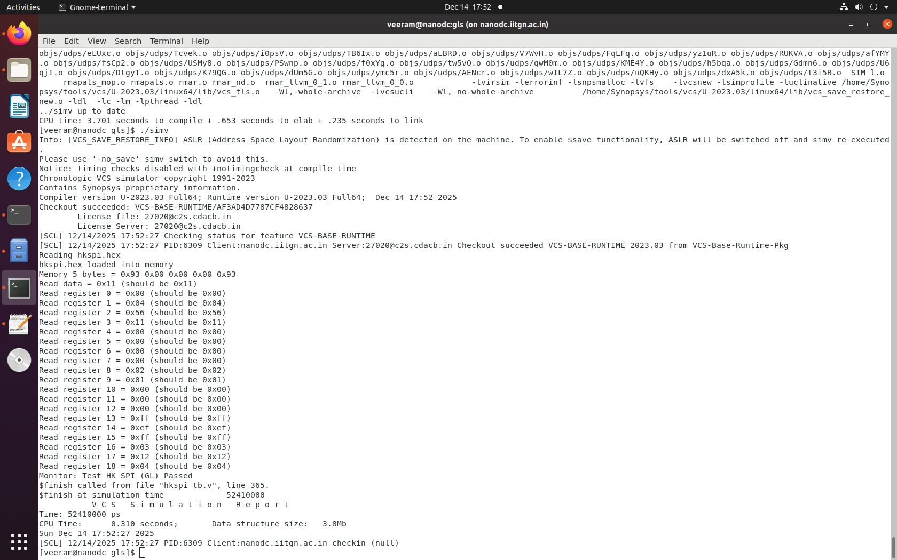
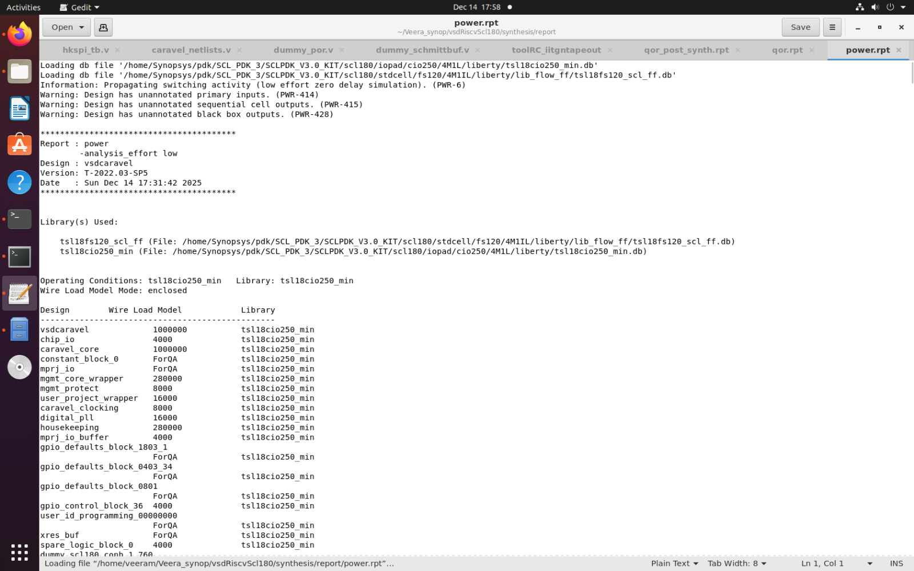

# RISC-V SoC Task 2 - Synopsys VCS + DC_TOPO Flow (SCL180)

This documentation provides a comprehensive guide for migrating from open-source simulation tools to industry-standard Synopsys EDA tools while maintaining design correctness and documentation quality throughout the entire workflow. The transition involves replacing all open-source tools with Synopsys toolchain components, requiring careful configuration and constraint management.

## Toolchain Migration

The transition from open-source simulation tools to production-grade Synopsys tools requires the complete removal of legacy tools from the entire design flow. This migration is fundamental to establishing an industry-standard design environment.

### Tools Removed

The following open-source tools must be completely eliminated from the design flow:

- **iverilog**: Open-source Verilog compiler - replaced with Synopsys VCS
- **gtkwave**: Open-source waveform viewer - replaced with DVE and Verdi

These tools must not appear anywhere in the project, including:
- Makefiles and build scripts
- TCL synthesis scripts
- Documentation and README files
- Log files and simulation outputs
- GitHub commit messages and repository history

### Tools Implemented

The new Synopsys toolchain consists of professional-grade EDA software:

#### Synopsys VCS (Verilog Compiler and Simulator)
**Version**: U-2023.03

VCS is the industry-standard Verilog compiler and simulator used for functional verification and gate-level simulation. Key features include:
- High-performance compiled-code simulation engine
- SystemVerilog and Verilog support
- Advanced debugging capabilities with DVE (Discovery Visualization Environment)
- Waveform generation in VPD (Value Change Dump) and FSDB formats
- Support for hierarchical simulation and design verification

#### Synopsys DC_TOPO (Design Compiler - Topographical Mode)
**Version**: T-2022.03-SP5

DC_TOPO performs logic synthesis using topographical optimization techniques. Key features include:
- Topographical synthesis for area-optimized designs
- Multi-corner optimization (FF, SS, TT process corners)
- Physical-aware synthesis with routing information
- Comprehensive timing, power, and area analysis
- Support for SCL180 standard cell libraries
- Blackbox and macro cell handling for hierarchical designs

---

## Functional Simulation Setup

Functional simulation validates the correct behavior of the RTL design before synthesis. This stage performs behavioral verification without timing considerations, ensuring the design logic meets specifications.

### Prerequisites

Before proceeding with functional simulation setup, ensure all required dependencies are properly installed and configured in your environment:

#### Required Software Components

- **SCL180 PDK (Process Design Kit)**
  - Complete library files for SCL180 180nm technology node
  - Includes Verilog models, standard cell libraries, and design rules
  - Essential for synthesis and simulation with correct technology parameters

- **RISC-V 32-bit GCC Toolchain**
  - Cross-compiler: riscv32-unknown-elf-gcc
  - Used for compiling C firmware into executable binaries
  - Converts test programs to machine code for simulation
  - Typical path: `/usr/bin/gcc/riscv32-unknown-elf`

- **Caravel User Project Framework**
  - VSD-provided framework containing SoC wrapper and interface definitions
  - Source from official vsd repository with iitgn branch
  - Provides project structure and example implementations

- **Synopsys EDA Tool Suite**
  - VCS simulator for functional and gate-level simulation
  - DC_TOPO for logic synthesis
  - Access to design tool licenses through Synopsys license server

### Test Instructions

#### Repository Setup and Environment Configuration

**Step 1: Clone Repository**

Clone the vsdRiscvScl180 repository and checkout the correct branch:

```bash
git clone https://github.com/vsdip/vsdRiscvScl180.git
cd vsdRiscvScl180
git checkout iitgn
```

This command clones the complete project containing RTL design files, testbenches, synthesis scripts, and documentation.

**Step 2: Install Dependencies**

Verify that the following are installed and accessible:
- DC_TOPO and VCS executables in system PATH
- SCL180 PDK libraries at accessible file system location
- RISC-V GCC toolchain with proper permissions
- License server connectivity for Synopsys tools

**Step 3: Source Synopsys Tools Environment**

Initialize the Synopsys tool environment using the provided setup script:

```bash
csh
source ~/toolRC_iitgntapeout
```

**What this script configures:**
- Sets Synopsys license server connections
- Configures tool binary paths (vcs, dc_shell)
- Establishes library search paths for SCL180 PDK
- Sets environment variables required by VCS and DC_TOPO
- Configures temporary file directory locations
- Initializes design tool licensing

**Note**: The `toolRC_iitgntapeout` script must be executed from your home directory or the directory where it resides. Ensure proper csh shell is available.

### Functional Simulation File Setup

#### Makefile Configuration and Path Updates

The simulation flow is controlled by a Makefile that manages compilation, simulation, and waveform generation. Proper configuration is essential for successful simulation.

**Step 1: Locate and Edit Makefile**

Navigate to the simulation directory:

```bash
cd dv/hkspi
```

Edit the Makefile at this location: `./dv/hkspi/Makefile`

**Step 2: Update Critical Paths**

The following variables must be configured to match your system installation:

**GCC_PATH Configuration:**
- Modify `GCC_PATH` to point to your RISC-V toolchain installation
- Example: `GCC_PATH?=/home/username/riscv32-unknown-elf/bin`
- Verify the path contains: riscv32-unknown-elf-gcc, riscv32-unknown-elf-objcopy, and other cross-compiler tools
- Use `which riscv32-unknown-elf-gcc` to verify correct installation path

**SCL180 IO Path Configuration:**
- Modify `scl_io_PATH` to point to your SCL180 IO pad library Verilog models
- Example: `scl_io_PATH = "/home/Synopsys/pdk/SCL_PDK_3/SCLPDK_V3.0_KIT/scl180/iopad/cio250/6M1L/verilog/tsl18cio250/zero"`
- This path contains Verilog models for input/output buffer cells
- Verify directory contains `.v` files for IO pads (cio250, cio180, etc.)

**Step 3: Apply Complete Makefile**

Replace your Makefile with the Synopsys VCS-compatible version. This Makefile replaces all iverilog references with VCS and updates all compilation targets:

```makefile
# SPDX-FileCopyrightText: 2020 Efabless Corporation
#
# Licensed under the Apache License, Version 2.0 (the "License");
# you may not use this file except in compliance with the License.
# You may obtain a copy of the License at
#
#      http://www.apache.org/licenses/LICENSE-2.0
#
# Unless required by applicable law or agreed to in writing, software
# distributed under the License is distributed on an "AS IS" BASIS,
# WITHOUT WARRANTIES OR CONDITIONS OF ANY KIND, either express or implied.
# See the License for the specific language governing permissions and
# limitations under the License.
#
# SPDX-License-Identifier: Apache-2.0

# PDK and project paths
scl_io_PATH = "/home/Synopsys/pdk/SCL_PDK_3/SCLPDK_V3.0_KIT/scl180/iopad/cio250/6M1L/verilog/tsl18cio250/zero"
VERILOG_PATH = ../../
RTL_PATH = $(VERILOG_PATH)/rtl
BEHAVIOURAL_MODELS = ../ 
RISCV_TYPE ?= rv32imc

# Compiler paths
FIRMWARE_PATH = ../
GCC_PATH?=/usr/bin/gcc
GCC_PREFIX?=riscv32-unknown-elf

# Simulation defines
SIM_DEFINES = +define+FUNCTIONAL +define+SIM

SIM?=RTL

.SUFFIXES:

PATTERN = hkspi

# Path to management SoC wrapper repository
scl_io_wrapper_PATH ?= $(RTL_PATH)/scl180_wrapper

# VCS compilation flags and options
VCS_FLAGS = -sverilog +v2k -full64 -debug_all -lca -timescale=1ns/1ps
VCS_INCDIR = +incdir+$(BEHAVIOURAL_MODELS) \
             +incdir+$(RTL_PATH) \
             +incdir+$(scl_io_wrapper_PATH) \
             +incdir+$(scl_io_PATH)

# Output file names
SIMV = simv
COMPILE_LOG = compile.log
SIM_LOG = simulation.log

.SUFFIXES:

all: compile

hex: ${PATTERN:=.hex}

# VCS Compilation target
compile: ${PATTERN}_tb.v ${PATTERN}.hex
	vcs $(VCS_FLAGS) $(SIM_DEFINES) $(VCS_INCDIR) \
	${PATTERN}_tb.v \
	-l $(COMPILE_LOG) \
	-o $(SIMV)

# Run simulation in batch mode
sim: compile
	./$(SIMV) -l $(SIM_LOG)

# Run simulation with GUI (DVE)
gui: compile
	./$(SIMV) -gui -l $(SIM_LOG) &

# Generate VPD waveform
vpd: compile
	./$(SIMV) -l $(SIM_LOG)
	@echo "VPD waveform generated. View with: dve -vpd vcdplus.vpd &"

# Generate FSDB waveform (if Verdi is available)
fsdb: compile
	./$(SIMV) -l $(SIM_LOG)
	@echo "FSDB waveform generated. View with: verdi -ssf <filename>.fsdb &"

check-env:
ifeq (,$(wildcard $(GCC_PATH)/$(GCC_PREFIX)-gcc ))
	$(error $(GCC_PATH)/$(GCC_PREFIX)-gcc is not found, please export GCC_PATH and GCC_PREFIX before running make)
endif

# Clean build artifacts
clean:
	rm -f $(SIMV) *.log *.vpd *.fsdb *.key
	rm -rf simv.daidir csrc DVEfiles verdiLog novas.* *.fsdb+
	rm -rf AN.DB

.PHONY: clean compile sim gui vpd fsdb all check-env
```

### Key Makefile Changes Explained

Understanding the modifications made to support Synopsys VCS is essential for troubleshooting and customization:

**Compilation Tool Changes:**
- **Replaced**: `iverilog -o file.vvp` → **With**: `vcs -o simv`
- VCS compiles Verilog to an executable (`simv`), not intermediate bytecode
- VCS uses compiled-code simulation for better performance

**Include Directory Syntax:**
- **Replaced**: `-I$(RTL_PATH)` → **With**: `+incdir+$(RTL_PATH)`
- VCS uses `+incdir+` syntax following Synopsys conventions
- Multiple include directories separated by spaces

**Definition Syntax:**
- **Replaced**: `-D` (GCC style) → **With**: `+define+` (VCS style)
- Example: `+define+FUNCTIONAL` instead of `-DFUNCTIONAL`

**VCS-Specific Compilation Flags:**
- `-sverilog`: Enable SystemVerilog support
- `+v2k`: Enable Verilog-2001 constructs
- `-full64`: Use 64-bit compiler (required for large designs)
- `-debug_all`: Enable full debug capabilities for DVE
- `-lca`: Line coverage analysis
- `-timescale=1ns/1ps`: Set simulator time units and precision

**Output File Changes:**
- **Removed**: `.vvp` and `.vcd` intermediate targets
- **Added**: Targets for `vpd` (VPD waveforms) and `fsdb` (FSDB waveforms)
- **New targets**: `gui` (DVE debugger), `fsdb` (Verdi waveforms)

**Clean Target Updates:**
- Removes VCS-generated directories: `simv.daidir`, `csrc`, `DVEfiles`, `verdiLog`
- Removes VCS temporary files: `.key`, `.vpd`, `.fsdb`
- Removes DVE/Verdi database files: `AN.DB`

### Compilation and Simulation Usage

#### Compile Only

Compile the testbench and RTL without running simulation:

```bash
make compile
```

**Output files created:**
- `simv`: Executable simulation model
- `compile.log`: Compilation messages and warnings
- `simv.daidir/`: VCS debug database directory (required for DVE)
- `csrc/`: C source files generated by VCS

**Typical output:**
```
vcs -sverilog +v2k -full64 -debug_all -lca -timescale=1ns/1ps \
    +define+FUNCTIONAL +define+SIM \
    +incdir+../ +incdir+../../rtl +incdir+../../rtl/scl180_wrapper +incdir+/path/to/scl180/io \
    hkspi_tb.v -l compile.log -o simv

Chronologic VCS simulator copyright 1991-2023
Parsing design file 'hkspi_tb.v'
[Additional compilation messages]
COMPILING
[Module compilation details]
```

#### Compile and Simulate (Batch Mode)

Compile and run simulation in batch mode without graphical interface:

```bash
make sim
```


**This command:**
1. Executes `make compile` (if not already done)
2. Runs the simulation executable: `./simv -l simulation.log`
3. Generates simulation.log with test results

**Typical output in simulation.log:**
```
Test Start at time 0
[Test messages and monitor outputs]
Test Complete at time [end_time]
```

#### Interactive Simulation with GUI

Launch simulation with DVE (Discovery Visualization Environment) graphical debugger:

```bash
make gui
```

**DVE features:**
- Real-time waveform viewing of all signals in hierarchy
- Signal search and filtering
- Zoom and pan controls for waveform timeline
- Variable inspector showing current values
- Breakpoint setting and conditional breakpoints
- Single-step execution and reverse debugging
- Memory and array visualization

**DVE window displays:**
- Left panel: Design hierarchy tree
- Top panel: Signal list with values
- Bottom panel: Waveform viewer
- Properties panel: Signal details and timing information

#### Waveform Generation and Analysis

Due the unavailability of synopsys verdi tool. I generate waveform using gtkwave 
**Generate VPD Waveform:**

```bash
vvp hkspi.vvp 
gtkwave hkspi.vcd hkspi_tb.v
```


#### Clean Build Files

Remove all generated simulation files and rebuild from scratch:

```bash
make clean
```

**This removes:**
- Compiled simulation executable (`simv`)
- All log files (`.log`)
- Waveform files (`.vcd`)
- VCS temporary directories (`simv.daidir`, `csrc`)

Use `make clean` before major changes or when troubleshooting compilation issues.

---

## Errors and Solutions

When transitioning from open-source to Synopsys tools, several common errors may occur. Below are the most frequent issues and their resolutions.

### Error 1: Variable TMPDIR References Non-Existent Directory

**Error Message:**
```
Variable TMPDIR (tmp) is selecting a non-existent directory
```

**Root Cause Analysis:**

VCS requires a temporary directory to store intermediate compilation files during the compilation process. The environment setup script (toolRC_iitgntapeout) sets `TMPDIR=tmp`, which is a relative path referring to a subdirectory named `tmp` in your current working directory. When you execute `make compile` in the `hkspi` directory, VCS searches for `hkspi/tmp`, which doesn't exist, causing this error.

**Detailed Solution:**

**Step 1: Create the temporary directory**

```bash
mkdir -p tmp
```

The `-p` flag creates parent directories if they don't exist and doesn't error if the directory already exists.

**Step 2: Verify directory permissions**

Ensure the tmp directory is writable:

```bash
chmod 755 tmp
ls -la tmp
```

You should see output like:
```
drwxr-xr-x  2 user group  4096 Dec 14 10:00 tmp
```

**Step 3: Re-run the compilation**

```bash
make clean      # Clean previous failed attempts
make compile    # Retry compilation
```

**Why This Happens:**

The setup script uses a relative path for temporary storage to avoid conflicts across different projects and users. Each project directory has its own isolated `tmp` directory for VCS working files, preventing cache collisions.

**Additional Context:**

If you're working in multiple simulation directories (dv/hkspi, dv/hkspi_gls), you may need to create `tmp` directories in each location:

```bash
cd dv/hkspi && mkdir -p tmp && cd ../hkspi_gls && mkdir -p tmp
```

### Error 2: Identifier Not Declared

**Error Message Example:**
```
Error-[IND] Identifier not declared
File: ../../rtl/dummy_schmittbuf.v, Line 15, Column 15
Identifier 'UDP_OUT' not declared [15.15]
```

**Root Cause Explanation:**

This error occurs because `default_nettype none` is set somewhere in your Verilog code, which requires explicit declaration of all signals and nets. Unlike `default_nettype wire`, this directive prevents implicit wire creation, forcing you to declare every signal explicitly. This is a strict type-checking feature that catches undeclared signal errors.

**Detailed Fix for dummy_schmittbuf.v:**

**Step 1: Open the file for editing**

```bash
gedit ../../rtl/dummy_schmittbuf.v
```

Or use your preferred editor (vi, nano, code, etc.)

**Step 2: Change the nettype directive**

Find the line:
```verilog
`default_nettype none
```

Change it to:
```verilog
`default_nettype wire
```

This allows implicit wire creation for undeclared signals, matching the behavior expected by VCS during the simulation.

**Step 3: Fix special character issues in module names**

VCS may have issues with special characters like `$` in module names. Find and replace:

From:
```verilog
module dummy__udp_pwrgood_pp$PG (...)
```

To:
```verilog
module dummy__udp_pwrgood_pp_PG (...)
```

Also update all references to this module throughout the file:

```verilog
// Change instantiations from:
dummy__udp_pwrgood_pp$PG instance_name (.pins(...));

// To:
dummy__udp_pwrgood_pp_PG instance_name (.pins(...));
```

**Step 4: Complete corrected module structure**

After corrections, the module should look like:

```verilog
`default_nettype wire

module dummy_schmittbuf (
    output UDP_OUT,
    input UDP_IN,
    input VPWR,
    input VGND
);
    
    assign UDP_OUT = UDP_IN;
    
endmodule
```

**Step 5: Re-run compilation**

```bash
make compile
```

The compilation should now proceed without identifier declaration errors.

**Prevention:**

When creating new RTL modules, consider:
- Using `default_nettype wire` if strict type-checking isn't required
- Explicitly declaring all signals if using `default_nettype none`
- Avoiding special characters in module names (use underscores instead of `$`)

---

## Synthesis Setup with DC_TOPO

Synthesis is the process of converting RTL (Register Transfer Level) design into a gate-level netlist using standard cells from the technology library. DC_TOPO performs topology-aware synthesis for area-optimized designs.

### Synthesis Objectives and Constraints

**Tool**: Synopsys DC_TOPO

**Primary Objectives:**
- Synthesize vsdcaravel RTL design using SCL180 standard cell libraries
- Maintain clean and reasonable timing constraints
- Preserve design functionality and correctness
- Generate comprehensive analysis reports

**Synthesis Outputs:**
- **Synthesized netlist**: Gate-level Verilog representation
- **Area reports**: Cell utilization and area breakdown
- **Timing reports**: Critical paths and slack analysis
- **Power reports**: Dynamic and static power consumption

### Important Synthesis Constraints

**Critical Design Requirement:**

POR (Power-On-Reset) and memory modules must remain as RTL modules and must NOT be synthesized:

1. **POR Module (dummy_por)**: Power-on-reset circuit must preserve RTL behavior for correct reset sequencing
2. **Memory Modules (RAM128, RAM256)**: Must remain as behavioral RTL models and not be synthesized into logic
3. **Blackbox Treatment**: These modules are treated as blackboxes (port-only definitions) during synthesis
4. **Macro Replacement**: Will be replaced with actual memory/POR macros during physical design and place-and-route

**Why This Matters:**

- Memory modules cannot be efficiently implemented as random logic gates
- POR circuits require specific analog behavior not captured in standard cell synthesis
- Blackbox approach preserves memory and POR functionality during gate-level simulation
- Macro replacement happens later in the design flow during P&R

### Synthesis Script Modification

The synthesis flow is controlled by a TCL script that must be significantly modified to handle blackbox modules correctly. The synth.tcl script implements specialized handling for POR and memory modules.

**Complete synth.tcl Script:**

```tcl
# ========================================================================
# Synopsys DC Synthesis Script for vsdcaravel
# Modified to keep POR and Memory modules as complete RTL blackboxes
# ========================================================================

# ========================================================================
# Load technology libraries
# ========================================================================
read_db "/home/Synopsys/pdk/SCL_PDK_3/SCLPDK_V3.0_KIT/scl180/iopad/cio250/4M1L/liberty/tsl18cio250_min.db"
read_db "/home/Synopsys/pdk/SCL_PDK_3/SCLPDK_V3.0_KIT/scl180/stdcell/fs120/4M1IL/liberty/lib_flow_ff/tsl18fs120_scl_ff.db"

# ========================================================================
# Set library variables
# ========================================================================
set target_library "/home/Synopsys/pdk/SCL_PDK_3/SCLPDK_V3.0_KIT/scl180/iopad/cio250/4M1L/liberty/tsl18cio250_min.db /home/Synopsys/pdk/SCL_PDK_3/SCLPDK_V3.0_KIT/scl180/stdcell/fs120/4M1IL/liberty/lib_flow_ff/tsl18fs120_scl_ff.db"
set link_library "* /home/Synopsys/pdk/SCL_PDK_3/SCLPDK_V3.0_KIT/scl180/iopad/cio250/4M1L/liberty/tsl18cio250_min.db /home/Synopsys/pdk/SCL_PDK_3/SCLPDK_V3.0_KIT/scl180/stdcell/fs120/4M1IL/liberty/lib_flow_ff/tsl18fs120_scl_ff.db"
set_app_var target_library $target_library
set_app_var link_library $link_library

# ========================================================================
# Define directory paths
# ========================================================================
set root_dir "/home/veeram/veera_synop/vsdRiscvScl180"
set io_lib "/home/Synopsys/pdk/SCL_PDK_3/SCLPDK_V3.0_KIT/scl180/iopad/cio250/4M1L/verilog/tsl18cio250/zero"
set verilog_files "$root_dir/rtl"
set top_module "vsdcaravel"
set output_file "$root_dir/synthesis/output/vsdcaravel_synthesis.v"
set report_dir "$root_dir/synthesis/report"

# ========================================================================
# Configure Blackbox Handling
# ========================================================================
set_app_var hdlin_infer_multibit default_none
set_app_var hdlin_auto_save_templates false
set_app_var compile_ultra_ungroup_dw false

# ========================================================================
# Create Blackbox Stub File for Memory and POR Modules
# ========================================================================
set blackbox_file "$root_dir/synthesis/memory_por_blackbox_stubs.v"
set fp [open $blackbox_file w]
puts $fp "// Blackbox definitions for memory and POR modules"
puts $fp "// Auto-generated by synthesis script"
puts $fp ""

# RAM128 blackbox
puts $fp "(* blackbox *)"
puts $fp "module RAM128(CLK, EN0, VGND, VPWR, A0, Di0, Do0, WE0);"
puts $fp "  input CLK, EN0, VGND, VPWR;"
puts $fp "  input \[6:0\] A0;"
puts $fp "  input \[31:0\] Di0;"
puts $fp "  input \[3:0\] WE0;"
puts $fp "  output \[31:0\] Do0;"
puts $fp "endmodule"
puts $fp ""

# RAM256 blackbox
puts $fp "(* blackbox *)"
puts $fp "module RAM256(VPWR, VGND, CLK, WE0, EN0, A0, Di0, Do0);"
puts $fp "  input CLK, EN0;"
puts $fp "  inout VPWR, VGND;"
puts $fp "  input \[7:0\] A0;"
puts $fp "  input \[31:0\] Di0;"
puts $fp "  input \[3:0\] WE0;"
puts $fp "  output \[31:0\] Do0;"
puts $fp "endmodule"
puts $fp ""

# dummy_por blackbox
puts $fp "(* blackbox *)"
puts $fp "module dummy_por(vdd3v3, vdd1v8, vss3v3, vss1v8, porb_h, porb_l, por_l);"
puts $fp "  inout vdd3v3, vdd1v8, vss3v3, vss1v8;"
puts $fp "  output porb_h, porb_l, por_l;"
puts $fp "endmodule"
puts $fp ""

close $fp
puts "INFO: Created blackbox stub file: $blackbox_file"

# ========================================================================
# Read RTL Files
# ========================================================================
read_file $verilog_files/defines.v

puts "INFO: Reading memory and POR blackbox stubs..."
read_file $blackbox_file -format verilog

# ========================================================================
# Read RTL files excluding memory and POR modules
# ========================================================================
puts "INFO: Building RTL file list (excluding RAM128.v, RAM256.v, and dummy_por.v)..."

set all_rtl_files [glob -nocomplain ${verilog_files}/*.v]

set exclude_files [list \
    "${verilog_files}/RAM128.v" \
    "${verilog_files}/RAM256.v" \
    "${verilog_files}/dummy_por.v" \
]

set rtl_to_read [list]
foreach file $all_rtl_files {
    set excluded 0
    foreach excl_file $exclude_files {
        if {[string equal $file $excl_file]} {
            set excluded 1
            puts "INFO: Excluding $file (using blackbox instead)"
            break
        }
    }
    if {!$excluded} {
        lappend rtl_to_read $file
    }
}

puts "INFO: Reading [llength $rtl_to_read] RTL files..."

read_file $rtl_to_read -define USE_POWER_PINS -format verilog

# ========================================================================
# Elaborate Design
# ========================================================================
puts "INFO: Elaborating design..."
elaborate $top_module

# ========================================================================
# Set Blackbox Attributes for Memory Modules
# ========================================================================
puts "INFO: Setting Blackbox Attributes for Memory Modules..."

if {[sizeof_collection [get_designs -quiet RAM128]] > 0} {
    set_attribute [get_designs RAM128] is_black_box true -quiet
    set_dont_touch [get_designs RAM128]
    puts "INFO: RAM128 marked as blackbox"
}

if {[sizeof_collection [get_designs -quiet RAM256]] > 0} {
    set_attribute [get_designs RAM256] is_black_box true -quiet
    set_dont_touch [get_designs RAM256]
    puts "INFO: RAM256 marked as blackbox"
}

# ========================================================================
# Set POR (Power-On-Reset) Module as Blackbox
# ========================================================================
puts "INFO: Setting POR module as blackbox..."

if {[sizeof_collection [get_designs -quiet dummy_por]] > 0} {
    set_attribute [get_designs dummy_por] is_black_box true -quiet
    set_dont_touch [get_designs dummy_por]
    puts "INFO: dummy_por marked as blackbox"
}

foreach_in_collection por_design [get_designs -quiet "*por*"] {
    set design_name [get_object_name $por_design]
    if {![string equal $design_name "dummy_por"]} {
        set_dont_touch $por_design
        set_attribute $por_design is_black_box true -quiet
        puts "INFO: $design_name set as blackbox"
    }
}

# ========================================================================
# Protect blackbox instances from optimization
# ========================================================================
puts "INFO: Protecting blackbox instances from optimization..."

foreach blackbox_ref {"RAM128" "RAM256" "dummy_por"} {
    set instances [get_cells -quiet -hierarchical -filter "ref_name == $blackbox_ref"]
    if {[sizeof_collection $instances] > 0} {
        set_dont_touch $instances
        set inst_count [sizeof_collection $instances]
        puts "INFO: Protected $inst_count instance(s) of $blackbox_ref"
    }
}

# ========================================================================
# Link Design
# ========================================================================
puts "INFO: Linking design..."
link

# ========================================================================
# Uniquify Design
# ========================================================================
puts "INFO: Uniquifying design..."
uniquify

# ========================================================================
# Read SDC constraints (if exists)
# ========================================================================
if {[file exists "$root_dir/synthesis/vsdcaravel.sdc"]} {
    puts "INFO: Reading timing constraints..."
    read_sdc "$root_dir/synthesis/vsdcaravel.sdc"
}

# ========================================================================
# Compile Design (Topographical synthesis)
# ========================================================================
puts "INFO: Starting compilation..."
compile_ultra -incremental

# ========================================================================
# Write Outputs
# ========================================================================
puts "INFO: Writing output files..."

write -format verilog -hierarchy -output $output_file
puts "INFO: Netlist written to: $output_file"

write -format ddc -hierarchy -output "$root_dir/synthesis/output/vsdcaravel_synthesis.ddc"
puts "INFO: DDC written to: $root_dir/synthesis/output/vsdcaravel_synthesis.ddc"

write_sdc "$root_dir/synthesis/output/vsdcaravel_synthesis.sdc"
puts "INFO: SDC written to: $root_dir/synthesis/output/vsdcaravel_synthesis.sdc"

# ========================================================================
# Generate Reports
# ========================================================================
puts "INFO: Generating reports..."

report_area > "$report_dir/area.rpt"
report_power > "$report_dir/power.rpt"
report_timing -max_paths 10 > "$report_dir/timing.rpt"
report_constraint -all_violators > "$report_dir/constraints.rpt"
report_qor > "$report_dir/qor.rpt"

# Report on blackbox modules
puts "INFO: Generating blackbox module report..."
set bb_report [open "$report_dir/blackbox_modules.rpt" w]
puts $bb_report "========================================"
puts $bb_report "Blackbox Modules Report"
puts $bb_report "========================================"
puts $bb_report ""

foreach bb_module {"RAM128" "RAM256" "dummy_por"} {
    puts $bb_report "Module: $bb_module"
    set instances [get_cells -quiet -hierarchical -filter "ref_name == $bb_module"]
    if {[sizeof_collection $instances] > 0} {
        puts $bb_report "  Status: PRESENT"
        puts $bb_report "  Instances: [sizeof_collection $instances]"
        foreach_in_collection inst $instances {
            puts $bb_report "    - [get_object_name $inst]"
        }
    } else {
        puts $bb_report "  Status: NOT FOUND"
    }
    puts $bb_report ""
}
close $bb_report
puts "INFO: Blackbox report written to: $report_dir/blackbox_modules.rpt"

# ========================================================================
# Summary
# ========================================================================
puts ""
puts "INFO: ========================================"
puts "INFO: Synthesis Complete!"
puts "INFO: ========================================"
puts "INFO: Output netlist: $output_file"
puts "INFO: DDC file: $root_dir/synthesis/output/vsdcaravel_synthesis.ddc"
puts "INFO: SDC file: $root_dir/synthesis/output/vsdcaravel_synthesis.sdc"
puts "INFO: Reports directory: $report_dir"
puts "INFO: Blackbox stub file: $blackbox_file"
puts "INFO: "
puts "INFO: NOTE: The following modules are preserved as blackboxes:"
puts "INFO:   - RAM128 (Memory macro)"
puts "INFO:   - RAM256 (Memory macro)"
puts "INFO:   - dummy_por (Power-On-Reset circuit)"
puts "INFO: These modules will need to be replaced with actual macros during P&R"
puts "INFO: ========================================"
```

### Understanding the synth.tcl Script

The synthesis TCL script contains multiple critical sections, each handling a specific aspect of the synthesis process:

#### 1. Load Technology Libraries

VCS needs compiled Liberty (.db) files containing cell timing, power, and area information:

- **I/O Pad Library**: `tsl18cio250_min.db` - Peripheral I/O buffers and ESD protection
- **Standard Cell Library**: `tsl18fs120_scl_ff.db` - Fast-fast corner for timing closure

The `read_db` command loads these databases into DC memory for technology mapping.

#### 2. Set Library Variables

Configure DC to use these libraries during synthesis:

- **target_library**: Destination library for standard cell mapping
- **link_library**: Reference libraries for cell resolution (includes `*` for current design)

These variables control which cells DC can instantiate during synthesis.

#### 3. Define Directory Paths

Establish convenient variables for file paths used throughout the script:

- **root_dir**: Project root for relative path construction
- **verilog_files**: RTL source directory
- **output_file**: Synthesized netlist destination
- **report_dir**: Analysis report output location

#### 4. Configure Blackbox Handling

Prevent DC from trying to synthesize memories:

- **hdlin_infer_multibit**: Disable automatic memory inference
- **hdlin_auto_save_templates**: Don't save memory templates
- **compile_ultra_ungroup_dw**: Preserve DesignWare hierarchy

#### 5. Create Blackbox Stub File

Dynamically generate Verilog module definitions for memory and POR:

- **RAM128**: 128-word, 32-bit memory (7-bit address)
- **RAM256**: 256-word, 32-bit memory (8-bit address)
- **dummy_por**: Power-on-reset circuit

These blackbox definitions have port lists only, no implementation, preventing synthesis.

#### 6. Read RTL Files

Read design files while excluding actual memory implementations:

- Read `defines.v` first (contains macros)
- Read blackbox stubs (establish module interfaces)
- Read all other RTL except RAM128.v, RAM256.v, dummy_por.v
- This ensures DC sees blackbox definitions before any implementations

#### 7. Elaborate Design

Build design hierarchy:

- Process RTL to create internal database
- Resolve module references to blackbox definitions
- Infer sequential logic and logic gates

#### 8. Mark Modules as Blackboxes

Set attributes to prevent optimization of protected modules:

- `set_attribute is_black_box true`: Declare as blackbox
- `set_dont_touch`: Prevent any modifications

#### 9. Link and Uniquify

Verify all module references and prepare for synthesis:

- **Link**: Check for unresolved references
- **Uniquify**: Create independent copies of multiply-instantiated modules

#### 10. Compile Design

Perform topographical synthesis:

```tcl
compile_ultra -incremental
```

**`compile_ultra -incremental`**: Performs synthesis in incremental topographical mode:
- Area-optimized synthesis using physical layout information
- Better area results than basic `compile` command
- Respects blackbox and dont_touch attributes
- Produces gate-level netlist with timing closure

#### 11. Write Outputs

Generate synthesis outputs:

- **Verilog netlist**: Gate-level implementation for GLS
- **DDC file**: Synopsys binary format for P&R
- **SDC constraints**: Updated timing constraints with netlist names

#### 12. Generate Reports

Produce analysis documents:

- **Area report**: Cell utilization and breakdown
- **Power report**: Dynamic and static power consumption
- **Timing report**: Critical paths and slack analysis
- **Constraints report**: Violated constraints (if any)
- **QOR report**: Quality of Results summary
- **Blackbox report**: Verification that blackboxes preserved





### Running the Synthesis Script

Navigate to the gls directory and execute DC_TOPO with the TCL script:

```bash
cd synthesis
dc_shell -f ../synth.tcl | tee synthesis_complete.log
```

**Command breakdown:**
- `dc_shell`: Launch Design Compiler in interactive shell mode
- `-f ../synth.tcl`: Execute TCL script file
- `| tee synthesis_complete.log`: Display output and save to log file

**Expected output:**
```
dc_shell> source synth.tcl
INFO: Created blackbox stub file: ...
INFO: Reading memory and POR blackbox stubs...
INFO: Building RTL file list...
INFO: Reading [N] RTL files...
INFO: Elaborating design...
INFO: Setting Blackbox Attributes for Memory Modules...
INFO: RAM128 marked as blackbox
INFO: RAM256 marked as blackbox
INFO: Setting POR module as blackbox...
INFO: dummy_por marked as blackbox
INFO: Protecting blackbox instances from optimization...
INFO: Protected M instance(s) of RAM128
...
INFO: Linking design...
INFO: Uniquifying design...
INFO: Starting compilation...
[Compilation progress...]
INFO: Synthesis Complete!
INFO: ========================================
INFO: Output netlist: .../vsdcaravel_synthesis.v
...
```


### Synthesis Verification

After synthesis completes, verify the results:

**Check synthesized netlist:**

```bash
cd output
cat vsdcaravel_synthesis.v 
```

Expected output shows blackbox definitions (port-only, no internals):

```verilog
module RAM128 (CLK, EN0, VGND, VPWR, A0, Di0, Do0, WE0);
  input CLK;
  input EN0;
  [Port definitions only - no logic]
endmodule
```

**Review synthesis reports:**

```bash
cd ../report
head -20 area.rpt    # Area breakdown
head -20 power.rpt   # Power estimates
head -20 timing.rpt  # Critical paths
head -20 blackbox_modules.rpt  # Blackbox verification
```

---

## Gate-Level Simulation (GLS) Setup

Gate-level simulation validates that the synthesized gate-level netlist behaves identically to the original RTL when combined with actual standard cell models. This critical verification step detects synthesis errors and ensures timing correctness.

### GLS Objective and Methodology

Gate-level simulation (GLS) differs fundamentally from functional simulation:

**Functional Simulation (RTL):**
- Simulates behavioral RTL description
- No timing delays
- Tests logical correctness
- Faster execution

**Gate-Level Simulation (GLS):**
- Simulates synthesized gate-level netlist
- Includes actual standard cell delays
- Verifies synthesis correctness
- Tests timing compliance
- Combined with RTL blackbox modules (RAM, POR)

### Setup Procedure

#### Step 1: Copy RTL Files to GLS Directory

Gate-level simulation requires both the synthesized netlist and RTL implementations of blackbox modules:

```bash
# Create GLS simulation directory
mkdir -p gls/

# Copy required RTL files to GLS directory
cp rtl/* gls/
```

This provides:
- Full RTL source files for reference
- RTL implementations of RAM128, RAM256, dummy_por (for GLS linking)
- Behavioral models needed for complete simulation

#### Step 2: Copy Synthesized Netlist

```bash
# Copy synthesis output to GLS directory
cp synthesis/output/vsdcaravel_synthesis.v gls/

# Copy standard cell library models (if needed)
# These are typically referenced through include paths in Makefile
```

The synthesized netlist contains:
- Gate-level implementation of synthesizable logic
- Blackbox instantiations of RAM128, RAM256, dummy_por
- All standard cell instances from SCL180 library

#### Step 3: Update GLS Makefile

Replace the GLS Makefile with the modified version that includes synthesis outputs and SCL180 models:

```makefile
# SPDX-FileCopyrightText: 2020 Efabless Corporation
#
# Licensed under the Apache License, Version 2.0 (the "License");
# you may not use this file except in compliance with the License.
# You may obtain a copy of the License at
#
# http://www.apache.org/licenses/LICENSE-2.0
#
# Unless required by applicable law or agreed to in writing, software
# distributed under the License is distributed on an "AS IS" BASIS,
# WITHOUT WARRANTIES OR CONDITIONS OF ANY KIND, either express or implied.
# See the License for the specific language governing permissions and
# limitations under the License.
#
# SPDX-License-Identifier: Apache-2.0

scl_io_PATH = "/home/Synopsys/pdk/SCL_PDK_3/SCLPDK_V3.0_KIT/scl180/iopad/cio250/4M1L/verilog/tsl18cio250/zero"
scl_io_wrapper_PATH = ../rtl/scl180_wrapper
VERILOG_PATH = ../
RTL_PATH = $(VERILOG_PATH)/rtl
GL_PATH = $(VERILOG_PATH)/gl
BEHAVIOURAL_MODELS = ../gls
RISCV_TYPE ?= rv32imc
PDK_PATH = /home/Synopsys/pdk/SCL_PDK_3/SCLPDK_V3.0_KIT/scl180/stdcell/fs120/4M1IL/verilog/vcs_sim_model 
FIRMWARE_PATH = ../gls
GCC_PATH?=/usr/bin/gcc
GCC_PREFIX?=riscv32-unknown-elf

SIM_DEFINES = +define+FUNCTIONAL +define+SIM
SIM?=gl

.SUFFIXES:

PATTERN = hkspi

all: ${PATTERN:=.vcd}
hex: ${PATTERN:=.hex}
vcd: ${PATTERN:=.vcd}

# VCS compilation target
simv: ${PATTERN}_tb.v ${PATTERN}.hex
	 vcs -full64 -debug_access+all \
	 $(SIM_DEFINES) +define+GL \
	 -timescale=1ns/1ps \
	 +v2k -sverilog \
	 -lca -kdb \
	 +incdir+$(VERILOG_PATH) \
	 +incdir+$(VERILOG_PATH)/synthesis/output \
	 +incdir+$(BEHAVIOURAL_MODELS) \
	 +incdir+$(RTL_PATH) \
	 +incdir+$(GL_PATH) \
	 +incdir+$(scl_io_wrapper_PATH) \
	 +incdir+$(scl_io_PATH) \
	 +incdir+$(PDK_PATH) \
	 -y $(scl_io_wrapper_PATH) +libext+.v+.sv \
	 -y $(RTL_PATH) +libext+.v+.sv \
	 -y $(GL_PATH) +libext+.v+.sv \
	 -y $(scl_io_PATH) +libext+.v+.sv \
	 -y $(PDK_PATH) +libext+.v+.sv \
	 $(GL_PATH)/defines.v \
	 $< \
	 -l vcs_compile.log \
	 -o simv

# Run simulation and generate VCD
%.vcd: simv
	 ./simv +vcs+dumpvars+${PATTERN}.vcd \
	 -l simulation.log

# Alternative: Generate FSDB waveform (if Verdi is available)
%.fsdb: simv
	 ./simv -ucli -do "dump -file ${PATTERN}.fsdb -type fsdb -add {*}" \
	 -l simulation.log

%.elf: %.c $(FIRMWARE_PATH)/sections.lds $(FIRMWARE_PATH)/start.s
	 ${GCC_PATH}/${GCC_PREFIX}-gcc -march=$(RISCV_TYPE) -mabi=ilp32 -Wl,-Bstatic,-T,$(FIRMWARE_PATH)/sections.lds,--strip-debug -ffreestanding -nostdlib -o $@ $(FIRMWARE_PATH)/start.s $<

%.hex: %.elf
	 ${GCC_PATH}/${GCC_PREFIX}-objcopy -O verilog $< $@ 
 # to fix flash base address
	 sed -i 's/@10000000/@00000000/g' $@

%.bin: %.elf
	 ${GCC_PATH}/${GCC_PREFIX}-objcopy -O binary $< /dev/stdout | tail -c +1048577 > $@

# Interactive debug with DVE
debug: simv
	 ./simv -gui -l simulation.log

# Coverage report generation (optional)
coverage: simv
	 ./simv -cm line+cond+fsm+tgl -cm_dir coverage.vdb
	 urg -dir coverage.vdb -report urgReport

check-env:
ifeq (,$(wildcard $(GCC_PATH)/$(GCC_PREFIX)-gcc ))
	 $(error $(GCC_PATH)/$(GCC_PREFIX)-gcc is not found, please export GCC_PATH and GCC_PREFIX before running make)
endif

clean:
	 rm -f *.elf *.hex *.bin *.vcd *.fsdb *.log simv
	 rm -rf csrc simv.daidir DVEfiles ucli.key *.vpd urgReport coverage.vdb AN.DB

.PHONY: clean hex vcd fsdb all debug coverage check-env
```

### GLS Compilation and Execution

#### Clean and Prepare

```bash
cd dv/gls/
make clean
```

This removes any artifacts from previous simulation runs.

#### Copy Test Files

```bash
# Copy hkspi.hex from functional simulation directory
cp ../hkspi/hkspi.hex .
```

The `.hex` file contains the firmware/test program to execute during GLS.

#### Run GLS

```bash
make
```

This executes the complete GLS flow:
1. Compiles synthesized netlist with standard cell models
2. Links RTL implementations of blackbox modules
3. Runs simulation with test program
4. Generates VCD waveform

**Expected output:**
```
vcs -full64 -debug_access+all \
    +define+FUNCTIONAL +define+SIM +define+GL \
    ... [compilation flags] ...
    vcs_compile.log
[VCS compilation progress messages]
./simv +vcs+dumpvars+hkspi.vcd -l simulation.log
[Test execution output]
Simulation complete - hkspi.vcd generated
```


### GLS Waveform Viewing

View the simulation waveforms generated during GLS:

```bash
# Using gtkwave (open-source viewer)
gtkwave hkspi.vcd hkspi_tb &

```

**Key signals to inspect:**
- Clock and reset signals
- Data input/output signals
- Control signals (read/write, address buses)
- Power and ground rails
- Verify blackbox module behavior (RAM, POR)

### GLS Validation Criteria

**Successful GLS requires:**

1. **Functional Equivalence**: Output sequences match RTL simulation exactly
   - Compare waveforms between functional sim and GLS
   - Verify all test vectors pass
   - Check memory read/write operations

2. **No X-Propagation**: Undefined values (X) do not corrupt critical signals
   - X values should remain contained in insignificant signals
   - Critical control/data signals should never show X
   - May indicate incomplete constraints or missing definitions

3. **Timing Correctness**: No setup or hold timing violations
   - Check for race conditions
   - Verify synchronizer timing
   - Validate clock distribution timing

4. **State Consistency**: Registered values update correctly at clock edges
   - Verify register behavior
   - Check state machine transitions
   - Validate sequential logic timing

---

## Synopsys SolvNet References and Support

Synopsys SolvNet is the official knowledge base and support portal for all Synopsys tools, including VCS and DC_TOPO. Access to SolvNet is essential for resolving tool-specific issues and understanding advanced features.

### SolvNet Access Information

**Website**: https://solvnet.synopsys.com/

### Using SolvNet for Tool Troubleshooting

**SolvNet features:**
- Comprehensive tool documentation (VCS User Guide, DC_TOPO Reference)
- Known issues and workarounds database
- Installation and licensing troubleshooting
- Advanced usage examples and techniques
- Synthesis and simulation methodology guides
- Performance optimization documentation

**When to consult SolvNet:**
- Tool version compatibility questions
- Unexpected compilation or simulation errors
- Performance issues or timeouts
- Advanced synthesis techniques
- Timing constraint methodology
- Library and PDK-specific questions

---

## Conclusion

This comprehensive documentation covers the complete transition from open-source to industry-grade Synopsys EDA tools for RISC-V SoC design. Proper execution of this flow—from functional simulation through synthesis to gate-level validation—establishes a foundation for professional chip design methodology.

Key takeaways:
- Synopsys toolchain (VCS + DC_TOPO) is the industry standard for RTL verification and synthesis
- Blackbox modules (memory, POR) require special handling to preserve RTL behavior
- Comprehensive documentation and SolvNet support are essential resources
- Gate-level simulation validates synthesis correctness
- Careful constraint development ensures timing closure

