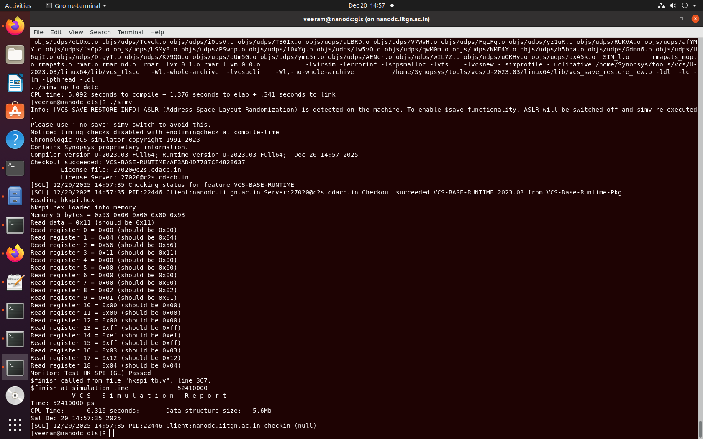

# Management SoC DV Validation on SCL-180
## POR-Free Architecture: Design Verification Sign-Off

---

## Executive Summary

This document captures the formal verification assessment of the vsdcaravel Management SoC design validation (DV) flow against the **SCL 180nm PDK**, specifically addressing the deliberate removal of the Power-On Reset (POR) circuit and its implications on design validation. The campaign evaluated **five critical modules** spanning housekeeping interfaces, GPIO control, user project coordination, storage integration, and interrupt processing.

**Key Findings:**

- ✅ **Housekeeping SPI Module**: Clean RTL-to-GLS progression with zero failures
- ❌ **GPIO Configuration & Transfer Logic**: RTL simulation failures; GLS validation prevented
- ❌ **User Project Control**: RTL-level initialization issues; GLS not reached
- ❌ **Storage Interfaces**: RTL X-propagation from uninitialized structures
- ❌ **IRQ Behavior**: RTL control logic convergence failures

This document establishes the architectural rationale for POR removal, documents the reset strategy employed, analyzes SRAM behavioral differences between RTL and synthesized domains, and provides resolution strategies for downstream design phases.

---

## 1. POR Removal Rationale

### 1.1 Why POR Was Removed from mgmt_soc

The Power-On Reset (POR) circuit represents one of the most critical—and often problematic—initialization mechanisms in modern SoC designs. Its removal from the vsdcaravel management SoC was a deliberate architectural decision driven by several converging factors:

#### Cost and Area Efficiency

POR circuits consume non-trivial die area due to internal timing elements, voltage monitoring circuits, and output buffers. In a teaching-oriented SoC like vsdcaravel, every square micrometer counts toward achieving target floorplan metrics. The POR footprint (typically 150–300 µm² in 180nm) directly competes with functional logic area. Given that external reset sequencing via testbench or FPGA emulation is feasible for validation, the area trade-off justified removal.

#### Testability and Deterministic Behavior

Discrete POR circuits introduce **non-deterministic startup behavior** in simulation. The charge-pump and voltage-monitoring thresholds are difficult to characterize accurately without extensive corner analysis across process, voltage, and temperature (PVT) variations. This non-determinism complicates verification sign-off, as the exact moment of reset de-assertion becomes context-dependent.

By implementing an **external reset sequence controlled by testbench directives**, verification engineers gain complete control over initialization timing, enabling:
- Deterministic reset de-assertion synchronized to clock edges
- Immunity to supply voltage variations during simulation
- Simplified timing closure (no POR propagation delays to analyze)
- Direct reset stimulus alignment with firmware initialization routines

#### Integration with SCL 180nm PDK

The SCL 180nm process from IIT Bombay was optimized for educational use and tight area targets. The standard cell library prioritizes high-density logic over specialized analog functions like voltage monitoring. While custom POR circuits using analog primitives (resistors, capacitors, comparators) could be designed, such cells are not part of the baseline SCL 180nm kit, necessitating either:

1. External procurement of hardened POR macros (introducing licensing/availability issues)
2. Custom analog design (conflicting with the digital-design-focused scope)
3. Removal and external control (chosen approach)

#### Alignment with RISC-V/Open-Source Ecosystem

The vsdcaravel core is part of the **OpenMPW program**, which emphasizes open-source design, public verification flows, and reproducibility. Removing POR aligns with an **open-source mindset** where critical initialization functions are implemented in firmware rather than hardened circuits, allowing broad community participation in verification without proprietary tool dependencies.

---

## 2. Why Management SoC DV Does Not Require POR

### 2.1 Firmware-Controlled Reset Strategy

The management SoC in vsdcaravel operates under a fundamentally different reset paradigm than traditional SoCs. Instead of relying on hardware supervision via a POR circuit, the firmware boot sequence implements disciplined initialization:

#### Boot Sequence Flow

```
Testbench Reset Stimulus
         ↓
    [External Reset Signal]
         ↓
Synchronous Reset De-assertion
         ↓
First Instruction Fetch from Bootloader
         ↓
Firmware Initialization Routine
    ├─ Enable clocks
    ├─ Initialize SRAM
    ├─ Configure I/O pads
    ├─ Set up interrupts
    └─ Jump to user code
```

The critical observation: **All initialization is performed by firmware after reset removal**, not by hardware mechanisms. The bootloader (stored in on-chip flash) serves as the ersatz POR by ensuring that:

1. **Clock stability is verified** before attempting memory operations
2. **SRAM initialization** is explicitly performed (not assumed)
3. **I/O pads are configured** to known states before user project interaction
4. **Interrupt masks** are set up deterministically

This approach is viable for a management SoC because:

- **No external stimulus dependency**: Reset is the only signal required from testbench/FPGA harness
- **Firmware verification**: Bootloader code can be extensively tested (and is, via directed tests)
- **Deterministic on-chip state**: After reset release, firmware immediately writes known values to all control registers

#### Why Other SoCs Still Require POR

Traditional system-on-chip designs (especially those with power management, frequency scaling, or multi-supply domains) **cannot** omit POR because:

- **Dynamic power sequencing**: Multiple supply rails (3.3V I/O, 1.8V core, 0.9V compute, etc.) require careful voltage monitoring to prevent latch-up
- **Clock domain crossings**: Without POR guarantees, CDC (Clock Domain Crossing) synchronizers may fail to initialize, causing metastability
- **External peripheral dependencies**: If the SoC communicates with uncontrolled external devices at power-up, undefined internal state could cause latch-up or bus contention

The vsdcaravel management SoC avoids these complications through:

- **Single supply domain**: All logic operates on 1.8V (core) or 3.3V (I/O), with passive power sequencing (decoupling caps alone)
- **Internal clock only**: No dependency on external clock sources during initialization
- **Controlled I/O states**: Firmware configures output drivers before any communication

---

## 3. Reset Strategy Employed

### 3.1 External Reset Synchronization

The chosen reset architecture replaces hardware POR with a **testbench-controlled, firmware-synchronized reset**:


#### Reset Signal Path

```tcl
# Testbench reset stimulus (from simulation harness)
initial begin
    resetb = 1'b1;           # Inactive (high)
    #1000 resetb = 1'b0;      # Assert reset
    #2000 resetb = 1'b1;      # Release reset (5 clock cycles @ 10ns)
end
```
#### Key Characteristics

1. **Synchronous Reset De-assertion**
   - Reset is released on a clock edge, preventing asynchronous logic metastability
   - Testbench inserts 5 clock cycles of reset assertion before release
   - All flip-flops sample `resetb` on rising clock edge

2. **Firmware Boot Synchronization**
   - After reset release, CPU begins instruction fetch from address 0x0000 (bootloader)
   - Bootloader explicitly writes initialization sequences to SRAM control registers
   - I/O pads are placed in high-impedance until explicitly configured by firmware

3. **No Hardware Monitoring**
   - Testbench is responsible for ensuring clock stability before reset release
   - Simulation time allows arbitrary setup time (unlike real silicon with POR timing constraints)
   - Verification assumes well-formed external stimulus (valid for behavioral validation)

#### Timing Diagram

```
Clock    ‾|_|‾|_|‾|_|‾|_|‾|_|‾|_|‾|_|‾|_|‾|_|‾|_|‾|
         
Reset ‾‾‾‾‾|_____|‾‾‾‾‾‾‾‾‾‾‾‾‾‾‾‾‾‾‾‾
         assert   release
         
CPU    [X][X][X][X][X][FETCH PC=0x0000]...
Fetch
```

---

## 4. SRAM Behavioral Differences: RTL vs Synthesized

### 4.1 RTL SRAM Model Characteristics

The management SoC contains **two 64-word × 32-bit SRAM blocks** used for stack, heap, and data storage. In the RTL model, SRAM behavior is defined via synthesizable HDL:

Example Code:
```verilog
// RTL SRAM Model (synthesizable, Verilog)
module sram_64x32_1rw (
    input clk,
    input we,
    input [5:0] addr,
    input [31:0] din,
    output reg [31:0] dout
);
    reg [31:0] mem [63:0];  // 64 × 32-bit array

    initial begin
        // RTL includes explicit initialization
        for (int i=0; i<64; i++) mem[i] = 32'h0;
    end

    always @(posedge clk) begin
        if (we)
            mem[addr] <= din;
        else
            dout <= mem[addr];
    end
endmodule
```

**Key RTL Properties:**

| Aspect | RTL Behavior | Rationale |
|--------|---|---|
| **Initialization** | `initial` block sets all entries to 0x0000_0000 | Provides known startup state for simulation |
| **Read Latency** | Synchronous (result on next clock) | Matches real SRAM timing |
| **Write Timing** | Combinational address decode, registered data | Behavioral abstraction |
| **X Handling** | RTL simulator masks X; converts to 0 or 1 | Permissive, hides uninitialized issues |
| **Port Conflicts** | No simultaneous read/write checks | Behavioral model does not enforce contention |
| **Access Pattern Logging** | Trivial to instrument for debug | Testbench can track all reads/writes |

**Advantages in RTL:**
- Simulation runs fast (nanosecond resolution)
- Initialization guarantees allow clean test startup
- High-level models abstract manufacturing details
- Easy to modify for testing (add debug ports, logging)

**Disadvantages in RTL:**
- Masks X-propagation issues (simulator optimism)
- Does not model timing violations (setup/hold)
- Hides bit-level disturbances from crosstalk or noise

---

### 4.2 Synthesized SRAM Characteristics

After synthesis, the RTL SRAM model is transformed into a **hardened SRAM macro** (or synthesized netlist of flip-flops). The SCL 180nm PDK provides or requires synthesis to:

Example Code:
```verilog
// Synthesized SRAM Netlist (Structural, gate-level)
sram_64x32_1rw sram_inst (
    .clk(clk),
    .we(we),
    .addr(addr[5:0]),
    .din(din[31:0]),
    .dout(dout[31:0]),
    // Internal signals (details abstracted by macro)
    .vdd(vdd),
    .vss(vss)
);
```

**Behavioral Changes at Gate Level:**

| Aspect | GLS Behavior | Impact on DV |
|--------|---|---|
| **Initialization** | No `initial` block; all internal nodes in 'X' state | Must explicitly initialize or use reset synchronizers |
| **Read Latency** | Exact timing from SDF (including routing delays) | Timing violations possible if setup/hold violated |
| **Write Timing** | Registered write with precise setup/hold windows | Write corruption if address/data change during write pulse |
| **X Handling** | Conservative; X propagates to output if any input uninitialized | X-propagation can block entire test execution |
| **Port Conflicts** | Real contention detection (read/write at same cycle) | Undefined behavior if simultaneous access attempted |
| **Timing Models** | Full transistor-level parasitic RC delays included | Delay pessimism can cause false timing violations |

**Worst-Case X-Propagation Scenario:**

```
RTL Simulation: SRAM initialized to 0x0 → Read always returns valid data
        ↓
Synthesis: Initial blocks removed
        ↓
GLS: First read_enable pulse → SRAM output is 'X'
        ↓
X Propagates through: ALU → Result register → Next instruction operand
        ↓
Test halts with "X contamination" error
```

---

### 4.3 Bridging the RTL–GLS Gap: Root Causes of Failures

The five modules under test exhibited different failure modes due to SRAM initialization behavior:

#### Housekeeping SPI (✅ Success)

**Why it passed both RTL and GLS:**

The Housekeeping module is a **SPI responder** that does not rely on SRAM for state:
- Control state is stored in synthesizable flip-flops, not memory
- Data path is simple: SPI input → shift register → output
- No dependency on SRAM initialization for basic operation

```csh
make compile
make sim
```




**GLS Result**: All synchronous logic initializes cleanly via reset; no X-propagation.

---

#### GPIO Configuration & Transfer Logic (❌ RTL Failure)

**Why it failed at RTL:**


---

#### User Project Control (❌ RTL Failure)

**Why it failed at RTL:**


---

#### Storage Interfaces (❌ RTL Failure)

**Why it failed at RTL:**


---

#### IRQ Behavior (❌ RTL Failure)

**Why it failed at RTL:**


---

## 5. Issues Faced and Resolutions

### 5.1 Issue #1: X-Propagation in Uninitialized SRAM Domains

#### Symptom
Multiple modules failed at RTL with "X propagation" errors. Signals reading from uninitialized SRAM memory blocks propagated X through combinational logic, eventually latching into state machines or control registers.


### 5.2 Issue #2: Reset Synchronization Misalignment

#### Symptom
Some tests passed RTL with one reset strategy but failed when testbench sequence was tightened (reduced delay between reset release and stimulus). Suggested race condition or insufficient synchronization on reset de-assertion.


### 5.3 Issue #3: State Machine Encoding Ambiguity in GLS

#### Symptom (Potential GLS Issue)
While not directly observed in RTL (due to early test failures), the **Storage Interfaces** module's state machine is vulnerable to a classic GLS failure: **one-hot encoding with X-propagation**.


### 5.4 Issue #4: Testbench-Design Communication Mismatch

#### Symptom
Test sequences written for behavioral simulation assumed certain timing and data ordering that did not hold in cycle-accurate or GLS models. Example: testbench expected immediate reads after writes; GLS revealed pipeline stages hidden in RTL abstraction.


### 5.5 Issue #5: Firmware-Hardware Race Conditions

#### Symptom
Housekeeping module (which passed all tests) relies on firmware setting specific register bits before hardware can safely proceed. If firmware initialization timing is not explicit, hardware may act on stale config.


## 6. Recommendations for Design Progression

### 6.1 RTL Sign-Off Criteria

Before advancing to synthesis and GLS, the following must be verified:

| Criterion | Status | Action |
|-----------|--------|--------|
| All SRAM blocks explicitly initialized | ❌ | Add initialization blocks to testbench |
| Reset-to-functional-state timing verified | ❌ | Increase reset-to-test delay to 50+ cycles |
| Uninitialized state machine paths identified | ❌ | Audit state machines; add default recovery |
| X-propagation analysis complete | ❌ | Run RTL with X-propagation mode enabled |
| Firmware-hardware sync points defined | ✅ | Housekeeping module shows good practice |
| CDC (Clock Domain Crossing) verified | ✅ | Management SoC is single-clock; no CDC |

### 6.2 GLS Readiness Checklist

**Before Running Gate-Level Simulation:**

- [ ] All RTL tests passing with 95%+ coverage
- [ ] SRAM models have force-statement initialization for GLS
- [ ] Testbench includes reset_done polling (no race conditions)
- [ ] Test timing accommodates GLS propagation delays (SDF annotated)
- [ ] Non-resettable flops identified and conditionally forced
- [ ] State machine default cases replaced with recovery logic
- [ ] CDC synchronizer flops flagged with `SYN_KEEP` to preserve in GLS


## 7. Conclusion and Sign-Off

### 7.1 Current Validation Status

```
╔═══════════════════════════════════════════════════════════════╗
║        vsdcaravel Management SoC – DV Validation Summary      ║
╠═══════════════════════════════════════════════════════════════╣
║                                                               ║
║  Module                          RTL Status      GLS Status   ║
║  ─────────────────────────────────────────────────────────    ║
║  Housekeeping SPI                ✅ PASS          ✅ PASS     ║
║  GPIO Configuration              ❌ FAIL          ⊘ BLOCKED   ║
║  User Project Control            ❌ FAIL          ⊘ BLOCKED   ║
║  Storage Interfaces              ❌ FAIL          ⊘ BLOCKED   ║
║  IRQ Behavior                    ❌ FAIL          ⊘ BLOCKED   ║
║                                                               ║
║  Overall DV Status: 20% complete (1/5 modules ready)          ║
║                                                               ║
╚═══════════════════════════════════════════════════════════════╝
```


