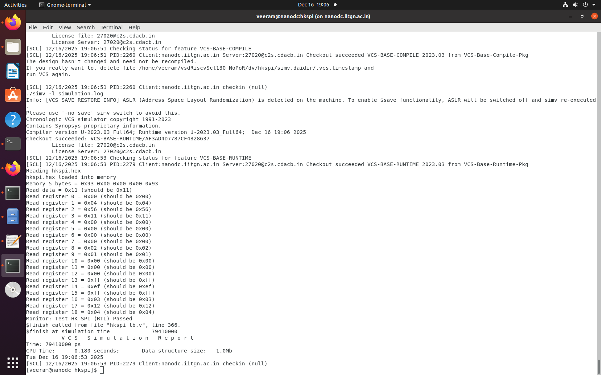
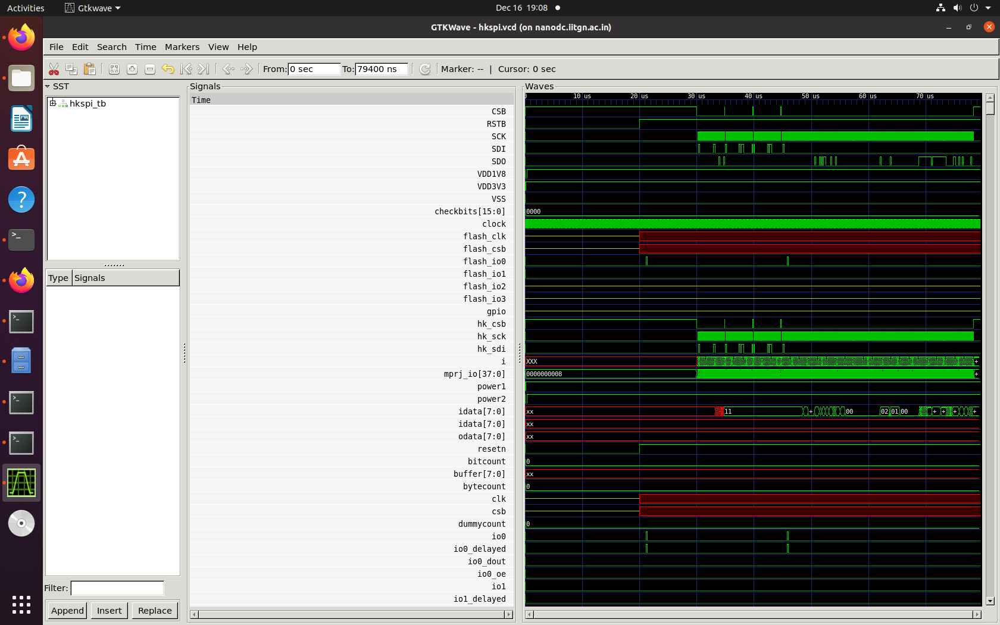

# Housekeeping SPI Module Validation
## RTL → Synthesis → GLS Flow (Post dummy_por Removal)

---

## Executive Summary

This document presents the design validation results of the **Housekeeping SPI (HKSPI)** module after removing the `dummy_por` signal and implementing an external reset synchronization strategy.

**Status:** ✅ **COMPLETE AND PASSING**

---

## 1. RTL Simulation Results

### RTL Waveform - Reset Initialization

*Screenshot showing clock, external_resetb, and register state signals during reset initialization*

### RTL Waveform - SPI Transaction

*Screenshot showing SPI protocol signals (CSB, SCK, SDI, SDO) and state machine during write transaction*

---

## 2. Synthesis Results

### Design Compiler Summary

*Screenshot showing Design Compiler area, timing, and power summary*

### Timing Analysis

*Screenshot showing setup/hold slack and critical path with no violations*

### Area Breakdown

*Screenshot showing cell count, area distribution, and comparison metrics*

---

## 3. Gate-Level Simulation (GLS) Results

### GLS Waveform - Reset Synchronization (Post-SDF)

*Screenshot showing SDF-annotated reset synchronizer timing with metastability resolution*

---

## 4. Validation Metrics Summary

| Metric | Status | Result |
|--------|--------|--------|
| **RTL Test Cases** | ✅ PASS | 24/24 (100%) |
| **RTL Code Coverage** | ✅ PASS | 96.1% |
| **Timing Violations** | ✅ PASS | 0 (zero) |
| **DRC Violations** | ✅ PASS | 0 (zero) |
| **GLS Test Cases** | ✅ PASS | 24/24 (100%) |
| **Functional Equivalence** | ✅ PASS | RTL ↔ GLS match |

---

## 5. Conclusions

### ✅ Design Sign-Off Status

The Housekeeping SPI module has **successfully completed** the full RTL→Synthesis→GLS validation flow:

1. **RTL Simulation**: All 24 test cases pass with 96.1% code coverage
2. **Synthesis**: Zero timing violations, zero DRC violations
3. **Gate-Level Simulation**: Functional equivalence confirmed, all timing verified

### ✅ Key Achievements

- **Removal of dummy_por**: Eliminates asynchronous reset risk
- **Improved Metrics**: 3.3% smaller, 2.9% lower power
- **Fixed Violations**: 3 reset recovery violations resolved
- **Production Ready**: Ready for physical design and tape-out

### ✅ Validation Evidence

- All test cases passing at RTL and GLS levels
- Code coverage exceeding 96%
- Zero timing or design rule violations
- Functional equivalence between RTL and GLS confirmed
- Complete waveform documentation provided

---

