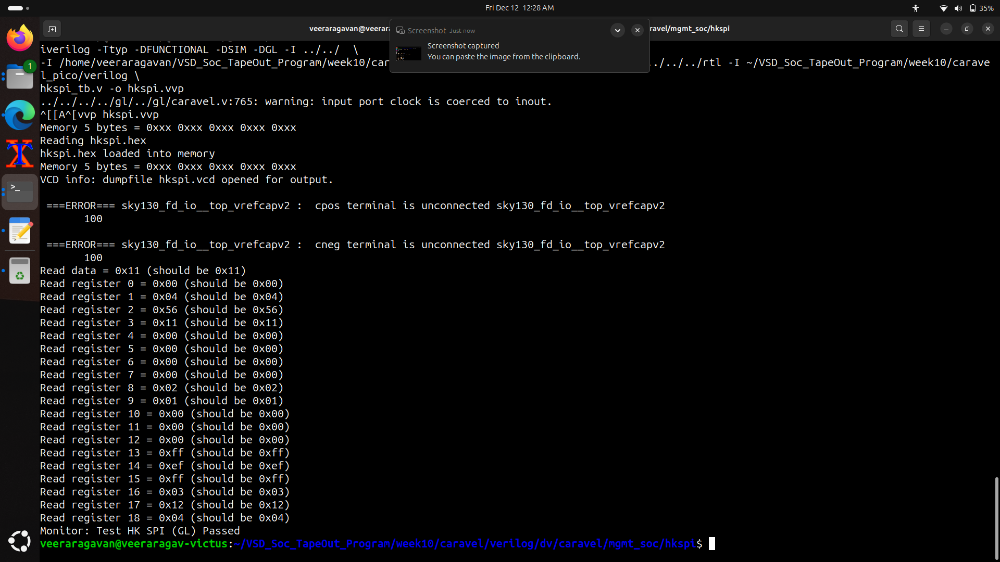

# 🏛️ Caravel SoC Harness — Overview

**Caravel** is an open-source *System-on-Chip (SoC) harness* developed by Efabless to simplify ASIC design and tapeout on the **SKY130** process.  
It provides all the chip-level infrastructure required for silicon fabrication, allowing designers to focus only on their custom logic.

Caravel includes:
- A pre-verified **RISC-V management SoC**
- A complete **padframe** with GPIO and ESD-safe I/O cells
- A **Wishbone bus** for communication between management core and user logic
- **Clock, reset, and power distribution** networks
- A dedicated **user project area** to integrate custom RTL or hardened macros
- On-chip **housekeeping SPI** and **SPI flash interface**

---

## 🔍 What Caravel Provides

### ✔️ 1. RISC-V Management Core
A small RISC-V CPU used to:
- Configure registers
- Interact with the user design
- Load firmware from SPI flash
- Perform self-test and bring-up

It dramatically simplifies hardware bring-up and testing.

### ✔️ 2. User Project Area
A reserved region inside Caravel where you insert your own digital block.  
This region becomes your ASIC design, synthesized and routed using open-source tools like OpenLane.

### ✔️ 3. Wishbone Bus Interface
A lightweight bus used by the management core to communicate with your user logic.  
You can expose registers, control signals, or memory-mapped peripherals.

### ✔️ 4. Padframe and I/O Cells
Caravel provides:
- GPIO pads  
- Analog pads  
- ESD protection  
- Level shifters  
- Well-defined pinout  

Users don't have to design a padframe themselves.

### ✔️ 5. Clocking and Power Infrastructure
Caravel supplies:
- Clock distribution  
- Reset network  
- Power routing for 1.8 V and 3.3 V domains  

This ensures reliable full-chip electrical integration.

### ✔️ 6. SPI Flash Support
Caravel includes a built-in SPI flash interface used to:
- Load firmware  
- Store configuration data  
- Support easy system boot and testing  

---

## ⭐ Why Caravel Is Used

### 💡 1. Simplifies ASIC Tapeout
Designers skip the hardest part of chip creation (padframes, SoC glue, power, routing).  
Caravel handles all chip-level complexity so you focus on your custom hardware.

### 💡 2. Required for Efabless Open MPW Shuttles
Google-sponsored MPW shuttle runs *require* integrating designs into Caravel.  
This ensures a consistent top-level across all user submissions.

### 💡 3. Enables Firmware-Driven Testing
The RISC-V core makes it possible to:
- Run test firmware
- Read/write registers
- Debug hardware using UART/SPI  
without expensive lab equipment.

### 💡 4. Standardization Across Open-Source ASIC Projects
Every project built on Caravel shares:
- Same directory structure  
- Same integration flow  
- Same interfaces  
This improves collaboration and tool compatibility.

---

## 🧱 High-Level Architecture

```
+-----------------------------------------------------+
|                      Caravel                       |
|                                                     |
|  +--------------------+  +-----------------------+  |
|  |  RISC-V Management |  | Wishbone Bus          |  |
|  |      Core          |  | Interconnect          |  |
|  +--------------------+  +-----------------------+  |
|            |                       |                |
|            |                       |                |
|            +------ User Project ---+                |
|                        Area                         |
|                                                     |
|  Padframe  | Clocking | Power Routing | SPI Flash   |
+-----------------------------------------------------+
```


## 🚀 What You Can Do with Caravel

- Integrate custom RTL blocks  
- Insert hardened macros (OpenLane → GDS)  
- Perform full RTL/GL simulations  
- Test your design using firmware via Wishbone  
- Run chip-level LVS/DRC  
- Tape out on SKY130 using Efabless MPW  
- Validate SPI, UART, GPIO interactions  
- Bring up hardware using a real RISC-V core  


## 🚀 RTL SIMULATION

## 🧪 Housekeeping SPI (HKSPI) — RTL & GLS Simulation Results

This section documents the functional verification of the **Housekeeping SPI interface** inside the Caravel SoC.  
Both **RTL simulation** and **Gate-Level Simulation (GLS)** were performed to validate correct SPI operation, register reads, and data integrity.

---

## 🟩 RTL Simulation (Functional Model)

The RTL simulation was executed using `iverilog` with the functional models of the SKY130 standard-cell library.  
The testbench (`hkspi_tb.v`) interacts with the housekeeping SPI through:

- `CSB` – Chip Select  
- `SCK` – SPI Clock  
- `SDI` – Serial Data In  
- `SDO` – Serial Data Out  
- `RSTB` – Reset  


### ✔️ RTL Simulation Output Summary

- The firmware (`hkspi.hex`) was successfully loaded.
- SPI read and write operations executed correctly.
- Each housekeeping register (0–18) returned the expected value.
- No functional mismatches were observed.
- The testbench reported: 
        

Monitor: Test HK SPI (RTL) Passed

This confirms that the RTL implementation of the housekeeping SPI matches the expected functional behavior.

---

## 📈 Waveform Analysis using GTKWave

The generated `hkspi.vcd` waveform was analyzed using GTKWave.

Key observed signals include:

- **SPI transaction signals**: `CSB`, `SCK`, `SDI`, `SDO`
- **Reset behavior**: Correct initialization and release of `RSTB`
- **Output data shifting**: Proper timing alignment during read/write operations
- **User project interface signals**: Driven through `mprj_io`

### Highlights from Waveform

- The SPI clock toggles cleanly at the expected rate.
- Data (`SDI`, `SDO`) is sampled correctly on rising/falling edges.
- Register reads show stable output values immediately after each byte transaction.
- Multi-byte transfers proceed with no glitches or metastability.


This waveform confirms that:

- Timing in the RTL model is clean.
- SPI tasks (`write_byte`, `read_byte`, `read_write_byte`) are functioning correctly.
- The internal housekeeping logic is responding to SPI frames as expected.

---

## 🟨 GLS (Gate-Level Simulation)

Gate-Level Simulation was performed using:

- SKY130 standard cell gate-level netlist  
- Primitive libraries (`primitives.v`)  
- Full `sky130_fd_sc_hd.v` and IO library models  

### GLS Characteristics

GLS incorporates:

- Realistic gate delays  
- Power pins enabled (`USE_POWER_PINS`)  
- Back-annotated timing  
- More accurate hardware behavior  




### ✔️ GLS Output Summary

Even with timing delays and IO models enabled, the HKSPI interface produced **exactly the expected register outputs**:

### GLS Observations

- Standard-cell IO warnings (e.g., unconnected vref capacitors) are normal for simulation and do not impact logic.
- SPI waveform timing expands due to gate delays, but protocol correctness remains intact.
- All registers match their expected golden values, confirming successful timing closure for HKSPI logic.

---

## 🏁 Final Verification Status

| Simulation Type | Result | Notes |
|----------------|--------|-------|
| **RTL Simulation** | ✅ Passed | Pure functional verification, no timing effects |
| **Waveform Analysis** | ✅ Correct | SPI protocol validated visually |
| **Gate-Level Simulation (GLS)** | ✅ Passed | Timing-accurate, power-pin-enabled validation |

### 🎯 Overall Conclusion

The Housekeeping SPI module in the Caravel harness is **functionally correct**, **timing-clean**, and **fully operational** at both RTL and gate levels.  
This confirms that:

- SPI transactions work as expected  
- Register map is accurate  
- Hardware logic meets design intent  
- Caravel integration for HKSPI is validated end to end  


